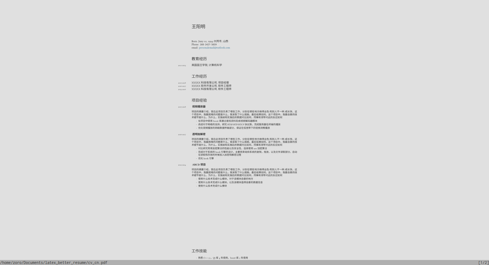
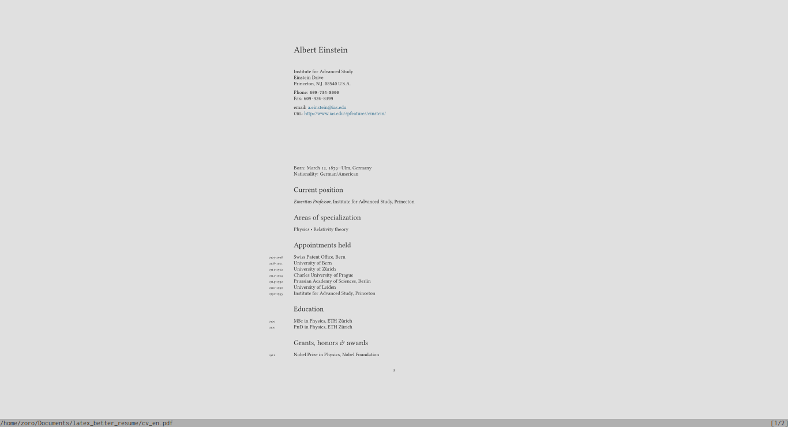

# latex_better_resume
  使用latex编写的个人简历
  
# 图片预览
<figure class="half">
    
    
</figure>

# 使用方法
- 需要下载Noto Sans CJK SC, migu 1M字体安装到系统.
- 安装texlive 系统保证系统环境中存在xelatex命令行.
- xelatex cv_cn.tex第一次运行请运行两次该命令才可生成正确的简历.
